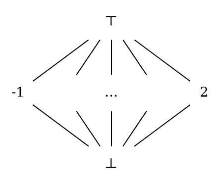

# Lattice

Let $b$ be the lattice for **Num**

```dot
digraph {
    size="3"
    node [width=0.4 shape=none margin=0.0]
    splines=false
    edge [dir=none ]
    ⊤ [width=3]
    ⊥ [width=3]
    ⊤ -> {-1,"  ","...", " ",2} -> ⊥
}
```

$$
unify(A ∈ Test) =
\begin{cases}
a \\
b & \text{if $n$ is even}
\end{cases}
$$



$$
test
$$